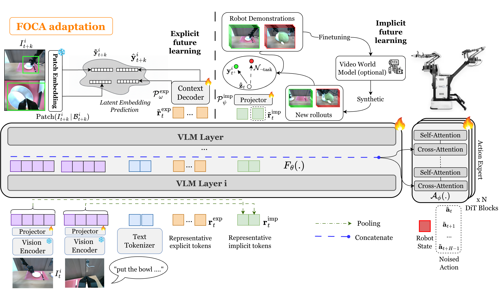

# FOCA: Future-Oriented Conditioning for Data-Efficient Vision-Language-Action Adaptation (ICML 2026)

<p align="center">
  <picture>
    <source media="(prefers-color-scheme: dark)" srcset="assets/ICML-logo-dark.svg">
    
  </picture>
</p>

[](https://focavla.github.io/)
[](https://arxiv.org/abs/2606.20867)
[](https://huggingface.co/collections/vrfai/foca-models)


## Overview

<p align="center">
  
</p>

Can robots learn new skills from only a handful of demonstrations?

Despite impressive progress, today's Vision-Language-Action (VLA) models struggle in this setting. We show that performance drops sharply as training data becomes scarce, exposing a critical weakness of current **few-shot adaptation** methods.

FOCA addresses this challenge by teaching robots to reason about **future interactions** rather than simply imitate actions. By combining future-oriented prediction with alignment to future goals, FOCA enables efficient adaptation, supports long-horizon decision making, and naturally enables **action-free co-training** with video world models through synthetic video supervision. The result is a simple and scalable framework that achieves state-of-the-art performance across simulation and real-world robot manipulation tasks.

## Table of Contents

- [Overview](#overview)
- [Installation](#installation)
- [1. LIBERO](#1-libero)
  - [1.1 LIBERO Evaluation](#11-libero-evaluation)
  - [1.2 LIBERO Finetuning](#12-libero-finetuning)
- [2. ROBOCASA](#2-robocasa)
  - [2.1 ROBOCASA Evaluation](#21-robocasa-evaluation)
  - [2.2 ROBOCASA Finetuning](#22-robocasa-finetuning)
- [3. Co-training with DreamGen](#3-co-training-with-dreamgen)
- [4. How to adapt your own data](#4-how-to-adapt-your-own-data)
- [Citation](#citation)
- [Acknowledgement](#acknowledgement)
- [Release Status](#release-status)


## Installation

### 1. Clone the repository

```bash
git clone https://github.com/cair-vinuni/FOCA
cd FOCA
```

### 2. Install core dependencies

```bash
uv pip install -e ".[pi0]"
uv pip install python-dotenv pytest serial nvitop 
uv pip install transformers==4.48.1 accelerate datasets==3.0.0 timm slot_attention peft

# To run libero simulation for eval
uv pip install robosuite==1.4.0 bddl gym easydict matplotlib tyro
```


## 1. LIBERO

<details>
<summary><b>Click to expand: Evaluation & Finetuning</b></summary>

### 1.1 LIBERO Evaluation

We release the following pretrained checkpoints reported in Table 1.a in [our paper](https://arxiv.org/pdf/2606.20867):

| Model                  | Description                  | 🤗 Download Link |
|------------------------|------------------------------|------------------|
| `foca_libero_s100`      | FOCA (trained with 100% data)             | [Link](https://huggingface.co/vrfai/foca_libero_s100)      |
| `foca_libero_s40`       | FOCA (trained with 40% data)              | [Link](https://huggingface.co/vrfai/foca_libero_s40)   |
| `foca_libero_s10`       | FOCA (trained with 10% data)              | [Link](https://huggingface.co/vrfai/foca_libero_s10)   |

**Step 1 — Set up the LIBERO simulator.**
Install the simulation dependencies and place the LIBERO package inside this repo:

```bash
uv pip install robosuite==1.4.0 bddl gym easydict matplotlib tyro

cd ..
git clone https://github.com/Lifelong-Robot-Learning/LIBERO.git
mv LIBERO/libero VLA-Humanoid/
rm -rf LIBERO
```

**Step 2 — Run the evaluation.**

```bash
python myutils/libero_evaluation_multi_thread.py \
        --gpus="0,1,2,3" \
        --pretrained_model_path="<path_to_model>" \
        --task_suite_name="libero_spatial" \
        --exp_name="<exp_name>"
```

Key evaluation arguments:

| Argument | Description |
|----------|-------------|
| `--gpus` | Comma-separated GPU ids to parallelize rollouts across. |
| `--pretrained_model_path` | Path to a checkpoint dir (contains `model.safetensors` and `config.json`). |
| `--task_suite_name` | LIBERO suite to evaluate (e.g. `libero_spatial`, `libero_object`, `libero_goal`, `libero_10`). |
| `--exp_name` | Name used for the results/log output directory, it will be logged in folder "eval_logs/". |

### 1.2 LIBERO Finetuning

| Dataset                                  | Description                                |🤗 Download Link |
|----------------------------------------|--------------------------------------------|---------------|
| `Libero_100`                            | LIBERO (100% data)                    | [Link](https://huggingface.co/datasets/vrfai/merged_libero_scale_100_mask_depth_noops_lerobot)     |
| `Libero_40`                            | LIBERO (40% data)                    | [Link](https://huggingface.co/datasets/vrfai/merged_libero_scale_40_mask_depth_noops_lerobot)     |
| `Libero_10`                            | LIBERO (10% data)                   | [Link](https://huggingface.co/datasets/vrfai/merged_libero_scale_10_mask_depth_noops_lerobot)     |


**Step 1 — Download the pretrained π0 base model.**
Download the base policy from [lerobot/pi0_base](https://huggingface.co/vrfai/pi0_base) and copy our policy config into its folder so the model loads with the FOCA congiguration:

```bash
cp configs/policy_config/default.json <path_to_downloaded_pi0_base_model>/config.json
```

**Step 2 — Download a LIBERO dataset.**
Pick one of the datasets from the table above and download it locally. The folder you download becomes the `--dataset.root` argument.

**Step 3 — Select the task constants.**
The constants file defines the camera views, state/action dimensions, and task metadata. For LIBERO, copy the LIBERO constants into place:

```bash
cp lerobot/common/constants_libero.py lerobot/common/constants.py
```

**Step 4 — Create `modality_map.json` for Object-of-Interest Masks.**
Before running the training scripts, navigate to the `./meta` directory of the corresponding dataset and create a file named `modality_map.json`. This file maps the original object-of-interest mask keys for each camera view to new keys, where each new key is the corresponding main observation key with the suffix `_mask`. 

For example, in the LIBERO dataset, the `modality_map.json` file should look like:

```bash
{
  "observation.images.object_of_interest_wrist_mask":"observation.images.wrist_image_mask",
  "observation.images.object_of_interest_mask":"observation.images.image_mask"
}
```

**Step 5 — Configure the FOCA components.**
These flags toggle the FOCA conditioning modules:

| Flag | Values | Meaning |
|------|--------|---------|
| `use_implicit` | `true` / `false` | Enable the implicit goal-conditioning module (uses goal/future images as guidance). |
| `use_explicit` | `true` / `false` | Enable the explicit future-object module (adds the future-object tracking loss). |
| `future_obj` | `all` / `none` | `all` uses the full future-object view (including background); `none` disables it. |
| `use_slot_att` | `none` / ... | Slot-attention variant for object grouping; `none` disables it. |

**Step 6 — Launch training.**

```bash
use_explicit=true
use_implicit=true
future_obj=all
use_slot_att=none

CUDA_VISIBLE_DEVICES=0,1,2,3 accelerate launch --num_processes=4 --main_process_port 29500 lerobot/scripts/train_accelerate.py \
    --policy.path=<path_to_downloaded_pi0_base_model> \
    --dataset.root=<path_to_libero_dataset> \
    --output_dir=outputs/train/$(date +%Y-%m-%d)/$(date +%H-%M-%S)_<your_exp_name> \
    --job_name=<job_name_in_wandb> \
    --config_path=configs/libero_config/default.json \
    --batch_size=13 \
    --policy.gradient_accumulation_steps=2 \
    --save_freq=10000 \
    --wandb.mode=online \
    --use_explicit=${use_explicit} \
    --use_implicit=${use_implicit} \
    --future_obj=${future_obj} \
    --use_slot_att=${use_slot_att} \
```

Key training arguments:

| Argument | Description |
|----------|-------------|
| `--policy.path` | Path to the downloaded π0 base model (with our `config.json` copied in from Step 1). |
| `--dataset.root` | Path to the downloaded LIBERO dataset from Step 2. |
| `--output_dir` | Where checkpoints and logs are written. |
| `--job_name` | Run name shown in Weights & Biases. |
| `--config_path` | Training hyperparameter config. |
| `--batch_size` | Per-process batch size (`13` fits a typical 4-GPU node; lower it if you hit OOM). |
| `--policy.gradient_accumulation_steps` | Gradient accumulation to increase the effective batch size. |
| `--save_freq` | Save a checkpoint every N steps. |
| `--wandb.mode` | `online` to log to W&B, `offline` to log locally, `disabled` to turn off logging. |

</details>


## 2. ROBOCASA

<details>
<summary><b>Click to expand: Evaluation & Finetuning</b></summary>

### 2.1 ROBOCASA Evaluation

We release the following pretrained checkpoints reported in Figure 3.c in [our paper](https://arxiv.org/pdf/2606.20867):

| Model                  | Description                  | 🤗 Download Link |
|------------------------|------------------------------|------------------|
| `foca_robocasa_100demos_5tasks`      | FOCA (trained with 100 demos for 5 tasks)             | [Link](https://huggingface.co/vrfai/foca_robocasa_100demos_5tasks)      |
| `foca_robocasa_30demos_5tasks`       | FOCA (trained with 30% demos for 5 tasks)              | [Link](https://huggingface.co/vrfai/foca_robocasa_30demos_5tasks)   |


**Step 1 — Install the RoboCasa simulator.**

```bash
pip install uv
git clone https://github.com/ARISE-Initiative/robosuite
cd robosuite && uv pip install -e . && cd ..

git clone https://github.com/jibby2803/robocasa_regenerate.git ./robocasa
cd robocasa && uv pip install -e . && cd ..

python robocasa/scripts/download_kitchen_assets.py
python robocasa/scripts/setup_macros.py
```

**Step 2 — Run the evaluation.**

Point `--args.model-dir` at a checkpoint and launch two seeds in parallel for full reproducibility:

```bash
python myutils/eval_robocasa.py \
    --args.model-dir "<your pretrained_model path> " \
    --args.exp-name "" \
    --args.num-trials 25 \
    --args.seed 0 \
    --args.gpu 0

python scripts/eval_robocasa.py \
    --args.model-dir "<your pretrained_model path>" \
    --args.exp-name "" \
    --args.num-trials 25 \
    --args.seed 1 \
    --args.gpu 1
```

> Results are aggregated over 50 trials total (25 per seed). Report the combined success rate across both runs.

Key evaluation arguments:

| Argument | Description |
|----------|-------------|
| `--args.model-dir` | Path to a pretrained model checkpoint directory. |
| `--args.exp-name` | Name used for the results and log output directory. |
| `--args.num-trials` | Number of rollout episodes per seed (we used 25 trails per seed). |
| `--args.seed` | Random seed; run seed `0` and seed `1` for full evaluation. |
| `--args.gpu` | GPU id for the process (also used as a log file suffix). |
| `--args.env-name` | Single task to evaluate (default: `TurnOnMicrowave`); omit to run all 5 tasks (`PnPCabToCounter`, `PnPCounterToCab`, `CoffeeSetupMug`, `TurnOffStove`, `TurnOnMicrowave`). |
| `--args.horizon` | Max steps per episode (default: `800`). |


### 2.2 ROBOCASA Finetuning

| Dataset                                  | Description                                |🤗 Download Link |
|----------------------------------------|--------------------------------------------|---------------|
| `Robocasa_100demos_5_tasks`                        | RoboCasa (100 demos for 5 tasks)          | [Link](https://huggingface.co/datasets/vrfai/robocasa_100_demos_lerobot_5_chosen_tasks_v2)     |
| `Robocasa_30demos_5_tasks`                        | RoboCasa (30 demos for 5 tasks)          | [Link](https://huggingface.co/datasets/vrfai/robocasa_30_demos_lerobot_5_chosen_tasks_v3)     |

The procedure is identical to [LIBERO finetuning](#12-libero-finetuning) — the same Steps 1, 3, and 4 apply (download the π0 base model, set the task constants, and configure the FOCA components). The only difference is that you point `--dataset.root` at a RoboCasa dataset from the table above.

```bash
use_explicit=true
use_implicit=true
future_obj=all
use_slot_att=none

cp lerobot/common/constants_libero.py lerobot/common/constants.py

CUDA_VISIBLE_DEVICES=0,1,2,3 accelerate launch --num_processes=4 --main_process_port 29500 lerobot/scripts/train_accelerate.py \
    --policy.path=<path_to_downloaded_pi0_base_model> \
    --dataset.root=<path_to_robocasa_dataset> \
    --output_dir=outputs/train/$(date +%Y-%m-%d)/$(date +%H-%M-%S)_<your_exp_name> \
    --job_name=<job_name_in_wandb> \
    --config_path=configs/libero_config/default.json \
    --batch_size=13 \
    --policy.gradient_accumulation_steps=2 \
    --save_freq=10000 \
    --wandb.mode=online \
    --use_explicit=${use_explicit} \
    --use_implicit=${use_implicit} \
    --future_obj=${future_obj} \
    --use_slot_att=${use_slot_att} \
```

</details>


## 3. Co-training with DreamGen

**Prerequisites:**
1. Finetune a Video World Model (VWM) following [this repo](<repo-url>).
2. Run inference with your finetuned VWM on your data to generate synthetic videos.

**Training stages.** FOCA co-trains in two stages:
- **Stage 1 — Action-free pretraining:** adapt the VLM using both real and synthetic videos by optimizing future-oriented objectives without requiring action supervision.
- **Stage 2 — VLA adaptation:** finetune the full policy with ground-truth actions.

<!-- | Dataset for stage 1 | Description | 🤗 Download Link |
|---------------------|-------------|-----------------|
| `Libero_DG_40`                        | LIBERO + DreamGen (40% data)          | [Link](https://huggingface.co/datasets/vrfai/libero_dreamgen_s40)     |
| `Libero_DG_10`                        | LIBERO + DreamGen (10% data)          | [Link](https://huggingface.co/datasets/vrfai/libero_dreamgen_s10)     | -->

> Code for the co-training pipeline with Libero is coming soon.


## 4. How to adapt your own data

Our code is adapted from [lerobot](https://github.com/huggingface/lerobot). To prepare and integrate your own dataset, you can check their documentation and tooling.


## Citation
If you find this work useful, please cite our paper:

```
@misc{nguyen2026focafutureorientedconditioningdataefficient,
      title={FOCA: Future-Oriented Conditioning for Data-Efficient Vision-Language-Action Adaptation}, 
      author={Duc Minh Nguyen and Nghiem Tuong Diep and Binh Gia Nguyen and Trong-Bao Ho and Doanh Le and Tan Q. Nguyen and Thien-Loc Ha and Nhiem Tran and Bao Thach and Nhat X. Tran and Tuan A. Tran and Artur Habuda and Philip Lund Møller and Tran Nguyen Le and Daniel Sonntag and Matthias Niepert and Khoa D. Doan and Vu Duong and Hung Ngo and Minh N. Vu and Duy M. H. Nguyen and An Thai Le and Ngo Anh Vien},
      year={2026},
      eprint={2606.20867},
      archivePrefix={arXiv},
      primaryClass={cs.CV},
      url={https://arxiv.org/abs/2606.20867}, 
}
```


## Acknowledgement
This repository is built with reference to the code of the following projects: [lerobot](https://github.com/huggingface/lerobot). Thanks for their awesome work!
